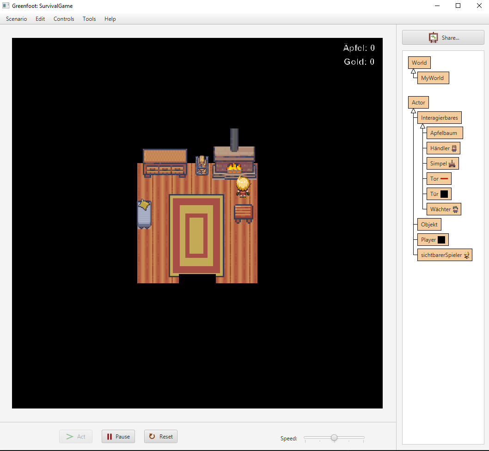
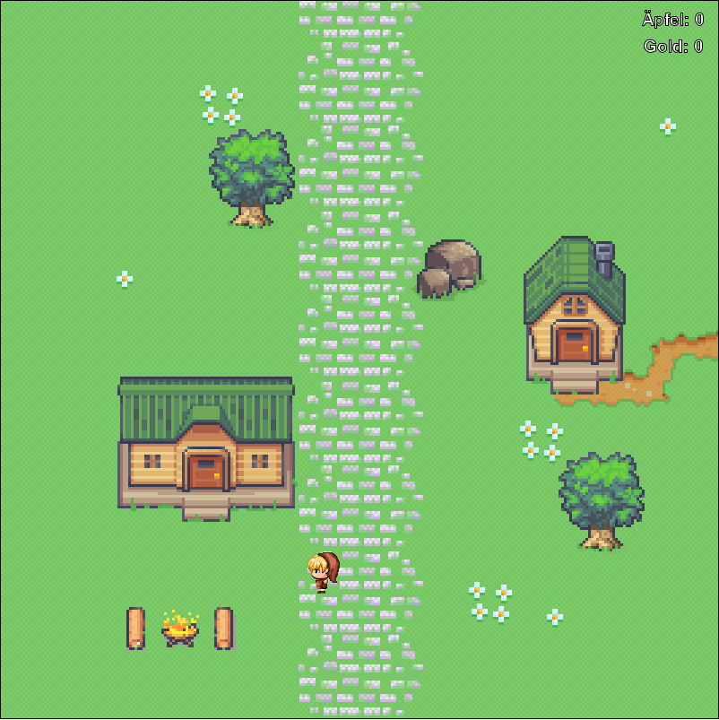
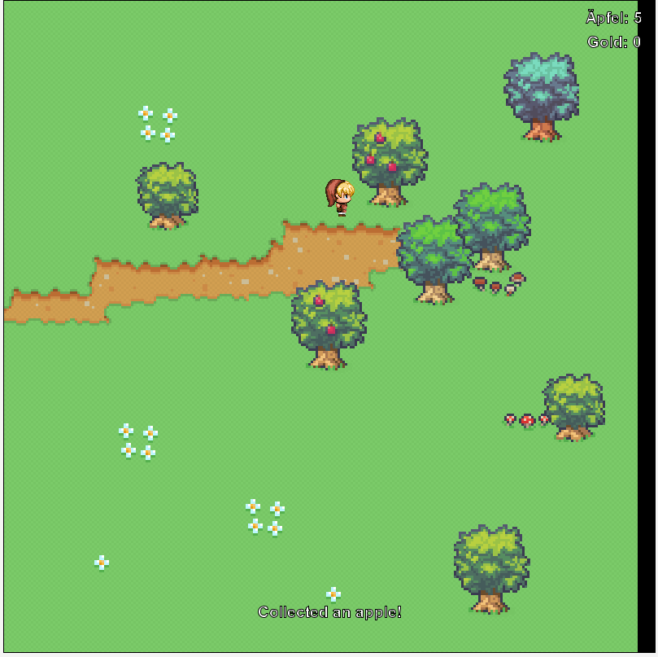
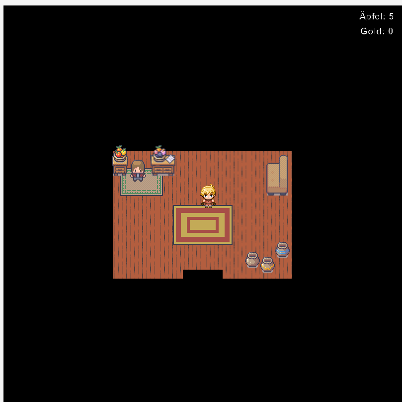

## Introduction
__Survival Game__ is an open source, graphical, top-down survival game where the player controls characters via mouse and interact with on-screen objects. It was developed using [Greenfoot](https://www.greenfoot.org/), using a combination of visual design tools and Java coding.

## Description 
In this game, you start inside your house and can explore nine unique cells. The game features various objects such as doors, campfires, NPCs (non-player characters) that the player can interact with in specific ways.

## Setup
* Install [Greenfoot](https://www.greenfoot.org/) 
* Open the [source](./source) directory with the Greenfoot IDE 
* hit the _Act_ button to start the game

## Game UI/UX
 * _Move_ You control your character's movement using the arrow keys. 
  * _Interact_ with objects (eg open a door, pick an apple from a tree etc) by using the '*e*' key
 * _Win_ the game by earning 20 Gold and paying the gatekeeper in the northern cell.

Start Screen

Wander along path

Picking Apples

In shop

### Notes:
Tested with Greenfoot version 3.8.0
